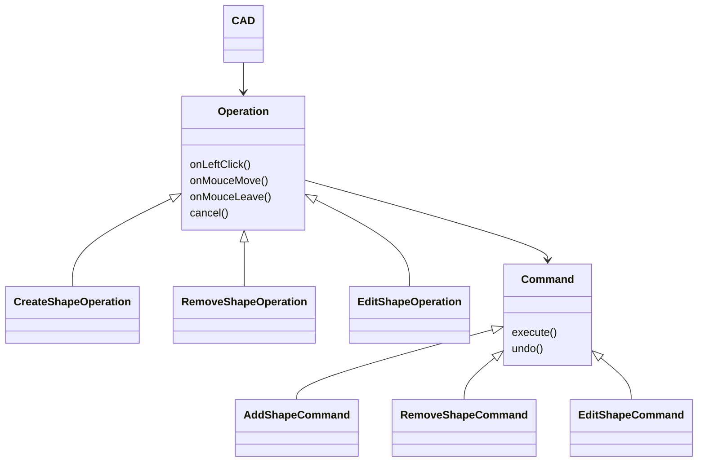

# 2023年7月27日 寝ながら考えた

Operation インターフェース

State パターンのため。操作モードを表現する。

操作モード

- 図形選択（初期、図形編集）
    - 図形選択自体は Undo の対象ではない。図形の編集が Undo の対象。
- 図形描画（各種）
- 図形削除

メンバ

- onLeftClick()
- onMouseMove()
- onLeave()
- cancel()
    - 操作中の状態なら操作を中止する。
    - 図形選択の場合、図形をハイライトにするが、選択後に別の操作に切り替えた場合ハイライトを解除するタイミングが必要だった。

実装クラス

- ShapeCreatingOperation
    - どの具象Shapeのインスタンスを作るかは注入する。またはFactoryMethodパターンを使う。
- ShapeSelectingOperation
- ShapeRemovingOperation

Command インターフェース

操作をオブジェクトにする。Undo 可能にする。

メンバ

- execute()
- undo()

派生クラス

- AddShapeCommand
- RemoveShapeCommand
- EditShapeCommand

描画バッファ

追加図形の形を確定するまでの表示、図形編集を確定するまでの表示に使う。

